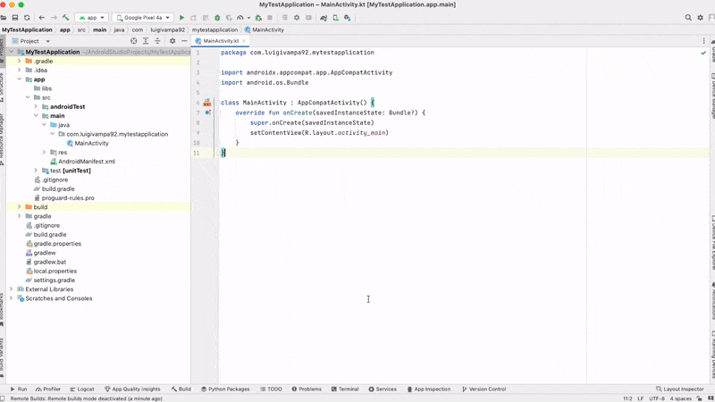

    

<h1 align="center">SkyForge</h1>

Android Studio IDE plugin that allows you to move gradle build process from your local computer to a remote server

 

- [Description](#description)
- [How it works?](#how-it-works)
- [Features](#features)
- [Preparation](#preparation)
- [Usage](#usage)
- [Demo](#demo)
- [IDE compatibility](#ide-compatability)
- [Support](#support)
- [Feedback](#feedback)
- [Acknowledgements](#acknowledgements)
- [License](#license)

## Description

This Android Studio plugin allows you to move high CPU and RAM-consuming Gradle builds of Android projects to a remote server and utilize its resources instead of your local machine. If you work on a weak workstation, like a tiny laptop, then this can greatly boost your performance. You will also experience much less fan noise and overheating. Just turn on the remote builds mode and let the server do all the hard work. You can fall back to local builds mode any time you want, for example, if your server is currently unavailable or you are outside of network coverage. Set up the server connection configuration in plugin settings once and reuse it for any of your Android Studio projects, any time you want.

## How it works?

It utilizes the power of ssh and rsync tools. The source code of your Android project is copied to a remote server, then a Gradle build is executed on the remote server, and then the results of the build (APK, AAB files, Proguard mappings, etc.) are pulled back to your local machine and used as usual.

## Features

- Seamless integration with the Android Studio graphical user interface. No special manual commands or scripts are needed. Just turn on the remote builds mode and use the "Run" and "Debug" buttons as usual. You can use Debugger to debug apps on your USB-connected devices, etc.
- UI is completely native, IDE works on your local computer, not on the server. No network lag for the UI. Low dependency on network quality and stability.
- No project source code modification is required. You don't need to add any Gradle build plugins, rewrite configs, etc.
- You can quickly switch between build modes on a local machine or on a remote server with a single button click.
- All communications between your local machine and your remote server are made ONLY via ssh and secured with its encryption.
- If your project contains dependencies that are pulled from your company's private Maven or Nexus repositories located inside your company's VPN, you can easily access them on your server by configuring proxy tunnels to your local machine.

## Preparation

- Prepare all the basic stuff on the remote server, openssh server, etc. **You will have to do this only once**. Check out [this server part instruction](./extra/docs/en/setup_remote.md) for details.
- Prepare ssh and rsync tools on your local computer, as well as proper ssh configuration. **You will have to do this only once**. Check out [this client part instruction](./extra/docs/en/setup_local.md) for details.
- Configure the Plugin. Set up an ssh connection to your remote server. Prepare dependencies for builds on remote machine **You will have to do this once for the project**. Check out [this plugin configuration instruction](./extra/docs/en/usage_general.md) for details.

## Usage

- Press the "Toggle Remote Builds" button to activate the remote builds mode for your project.
- That is all. Enjoy faster builds! You don't have to do anything specific from now on. Just use Android Studio as you would normally. You can press menu buttons to clean, rebuild projects, etc, you can manually execute any Gradle command in the terminal or Intellij Gradle plugin, you can press the "Run" or "Debug" buttons to make a build and run it on a connected USB device or emulator, you can use the debugger and you can use everything you normally use in your software developer routine. All Gradle commands will be executed on the server, not on your local machine.
- If you need to disable remote builds mode, just press the "Toggle Remote Builds" button once again, and all Gradle commands will now be performed locally.

## Demo

## IDE compatability

This plugin is meant to be used in Android Studio. Technically, it will also work in Intellij Idea, but only if your project is an Android project and Gradle is used as a build system.

## Support

* Star the repository ⭐
* [Buy me a coffee](https://www.buymeacoffee.com/luigivampa92) 💲

## Feedback

If you like, you can provide your feedback and suggest ideas for new features. Here is the list of contacts:
- [Email](mailto:luigivampa92@gmail.com) ✉️
- [Telegram](https://t.me/luigivampa92) 💬

## Acknowledgements

This Android Studio plugin uses a Gradle build plugin based on the [Mirakle](https://github.com/Adambl4/mirakle) project, which is in turn based on [Mainframer](https://github.com/buildfoundation/mainframer). My huge thanks to the authors and contributors of these projects, who introduced the first easy-to-use implementation of this idea and inspired me to develop this IDE plugin. Also, thanks to JetBrains for their open-source plugins and the Intellij developer community for helpful tips.

## License

Please see [LICENSE](LICENSE.md) for details.