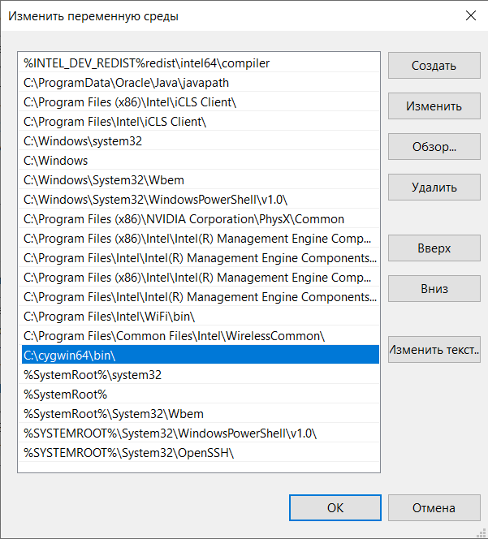

## Set up local computer running Windows

Among other operating systems Windows is the most inconvenient to set up and prepare all the necessary tools. It requires a couple of extra steps, but it is still nothing that can't be done. 

- [Choosing approach](#choosing-approach)
- [Install software](#install-software)
- [Set up an ssh connection to the server](#set-up-an-ssh-connection-to-the-server)
- [Next steps](#next-steps)

## Choosing approach

The main problem is that Windows does not have any of the necessary tools by default and does not have an easy way to install and run them. There is no way to run rsync on Windows natively, and the OpenSSH version that is shipped with Windows 10 and above does not support all the features and **CAN NOT** be used with a Plugin. TL;DR - you will have to use Linux tools on Windows, and there are two main approaches of how that can be done:

- **Cygwin** - third-party toolkit that brings a UNIX-like environment and a set of command-line tools for the Windows platform, basically "Bash for Windows"
- **WSL** - Windows Subsystem for Linux by Microsoft, basically a tightly integrated VM running a Linux distro in the container on Windows.

**Currently, only the Cygwin approach is supported**, WSL support will be added in future versions.

## Install software

### Install Cygwin

Go to the [official site of the Cygwin project](https://cygwin.com) and download the installer (<kbd>setup-x86_64.exe</kbd>). Run it, it will guide you through the installation process. Click <kbd>Next</kbd> on the first screen. Choose <kbd>Install from Internet</kbd> on the next screen. Leave the default root install directory (<kbd>C:\cygwin64</kbd>) and installation type <kbd>All Users</kbd>. Leave the default <kbd>Local Package Directory</kbd> on the next screen. Leave the default <kbd>Use System Proxy Settings</kbd> on the next screen. On the next screen choose some mirror URL (doesn't really matter which one). Now you will see a screen with a list of packages that can be installed. Cygwin installs a lot of UNIX-like tools by default, but you will have to pick a few extra points manually.

### Install OpenSSH and Rsync

You will need to choose these extra packages from the list to install in your new environment:
- <kbd>openssh</kbd>
- <kbd>rsync</kbd>
- <kbd>librsync2</kbd>

Type package names into <kbd>Search</kbd> text field to find the required stuff. Make sure to choose the version (pick the latest one) in the drop-down menu that is in the field to the right of the package name. **After all three packages are marked to be installed**, click the button to continue, then <kbd>Next</kbd> and Cygwin will be installed on your system with all the packages you need. Check the <kbd>Create icon on Desktop</kbd> box on the last screen, then <kbd>Complete</kbd>. After installation process is complete, you will get a new icon <kbd>Cygwin64 Terminal</kbd> on your desktop.

### Update the PATH environment variable

Now you have to edit the **PATH** environment value. The thing is - since Windows 10, Microsoft ships OpenSSH inside the Windows distribution, however, that binary is limited and **WILL NOT WORK** with the plugin, so you have to update the **PATH** to make sure that the system will use Cywgin's binary and not the original Windows binary when you execute <kbd>ssh</kbd> command. To do so, in the "Start" menu, find the <kbd>System (Control panel)</kbd> and run it, or click the right mouse button on a <kbd>computer</kbd> in Windows Explorer and select <kbd>Properties</kbd> in the drop-down menu. There you should find <kbd>Advanced system settings</kbd>, click it. Now find the <kbd>Environment Variables</kbd> button and click it. In the list of **SYSTEM** variables (the lower one in Windows 10) find the <kbd>PATH</kbd> variable and click <kbd>Edit</kbd>. You will be shown a list of values in <kbd>Path</kbd> variable. Click <kbd>Create</kbd> button and insert a new value in the list - <kbd>C:\cygwin64\bin</kbd>, that will point to Cygwin's binaries folder. Among other values, you will see this one: <kbd>%SystemRoot%\System32\OpenSSH</kbd>, remember it. Now on the right side, there are buttons <kbd>UP</kbd> and <kbd>DOWN</kbd> which can be used to move certain records above or below others. Your newly added record will be at the very bottom of the list. By using <kbd>UP</kbd> button, put your new <kbd>C:\cygwin64\bin</kbd> record so that it will be **ABOVE** the <kbd>%SystemRoot%\System32\OpenSSH</kbd>, and also **ABOVE** <kbd>%SystemRoot%\System32</kbd>, just in case. It should eventually look like this:



This is critical because the existence of the binaries is checked in the directories mentioned in that environment value, and the directories are checked sequentially, from the first value to the last, and where the first match is found, the binary from that directory is going to be used.

After you are done, click <kbd>OK</kbd> button in all the windows you have opened to properly save the changes.

### Check that the environment is set correctly

Open the terminal (**Windows CMD.exe**). You must make sure that your environment points to your newly installed binaries correctly. You can do this by running
```
$ ssh -V
```
This command should clearly return <kbd>OpenSSH_(VERSION)</kbd> and **NOT** <kbd>OpenSSH_for_Windows_(VERSION)</kbd>. Please make sure this is true, otherwise, the Plugin will not be able to work properly. Also check the location of the binary:
```
$ which ssh
```
This command should return <kbd>/usr/bin/ssh</kbd> and **NOT** something like <kbd>C:\Windows\System32\OpenSSH\ssh.exe</kbd>. Please make sure this is true before proceeding further.

Now check the rsync binary. This one is simple. Windows does not have any default version of it, so if the binary is found and you get an output like this, then everything is good:
```
$ which rsync
/usr/bin/rsync

$ rsync --version
rsync  version 3.2.7  protocol version 31
```

## Set up an ssh connection to the server

Now with all the binaries are properly installed, let's set up the connection properly. By this time, you should already have a prepared remote server with a properly configured openssh server. If not, check out [this instruction](./setup_remote.md).

First, the plugin **REQUIRES** you to connect to a remote server using public key authentication, and I highly recommend creating a dedicated key pair for this instead of using your normal one. So, if you haven't already created a key pair, let's do this. I recommend using the ED25519 algorithm because of its reliability and incredible performance. So, open a **Cygwin64 Terminal** and create a keypair with a command like this:
```
$ ssh-keygen -o -t ed25519 -f /home/pavel/.ssh/id_ed25519_android_builds_server -C "key_for_android_build_server" -P ""
```

**Note that you should insert your username instead of mine**, of course. And if you do not have <kbd>~/.ssh</kbd> folder for some reason, you should create it (<kbd>mkdir -p ~/.ssh</kbd>) before running the command above.

Now, after keys have been created, upload your public key (<kbd>cat ~/.ssh/id_ed25519_android_builds_server.pub</kbd>) onto the server. It should be added to the file <kbd>~/.ssh/authorized_keys</kbd> on your server.

Now, you should create a connection configuration with an alias. It should be added to the file <kbd>~/.ssh/config</kbd> on your local computer. If you do not yet have that file, then create it first: <kbd>touch ~/.ssh/config</kbd>, if you do, just append the record to the existing file contents and save the file. The record should look like this (**put your IP address instead of the one from the example below**):
```
Host android_builds_server
HostName 12.34.56.78
Port 34567
User builder
IdentityFile ~/.ssh/id_ed25519_android_builds_server
IdentitiesOnly yes
Compression yes
```

**IMPORTANT!** Make sure that you have created a file properly. If you used Windows Explorer, it could create your file with the name <kbd>config.txt</kbd>, not just <kbd>config</kbd>. The file name should be just <kbd>config</kbd>, without any extensions!

**IMPORTANT!** Make sure that your key pair files (<kbd>id_ed25519_android_builds_server</kbd> and <kbd>id_ed25519_android_builds_server.pub</kbd>), as well as your config file, are stored in the correct directory, which path is seen as <kbd>/home/pavel/.ssh</kbd> (**insert your user name or course**) in the Cygwin bash terminal, and **NOT** in the <kbd>C:\Users\pavel\.ssh</kbd>. This is critical because the new ssh binary will only look into <kbd>/home/pavel/.ssh</kbd>.

If you have mistakenly created all the files in <kbd>C:\Users\pavel\.ssh</kbd>, not in <kbd>/home/pavel/.ssh</kbd>, then you can easily copy them to the right place. Open the Cygwin Bash terminal and run the following command:
```
cp -R /cygdrive/c/Users/pavel/.ssh /home/pavel
```

After that, close the **Cygwin64 Terminal** and reopen the **Windows CMD.exe**. If you did everything correctly, you should be able to connect to the server using an alias. Try this:
```
$ ssh android_builds_server
```

You should successfully connect to the server. If not, please carefully check out, you could miss something in one of the previous steps. Configuring a Windows computer is more difficult than other operating systems, but fortunately, you will probably need to do this just once.

## Next steps

Congratulations! Everything is done. Your local computer is configured. Now proceed to [plugin usage instructions](./usage_general.md)
