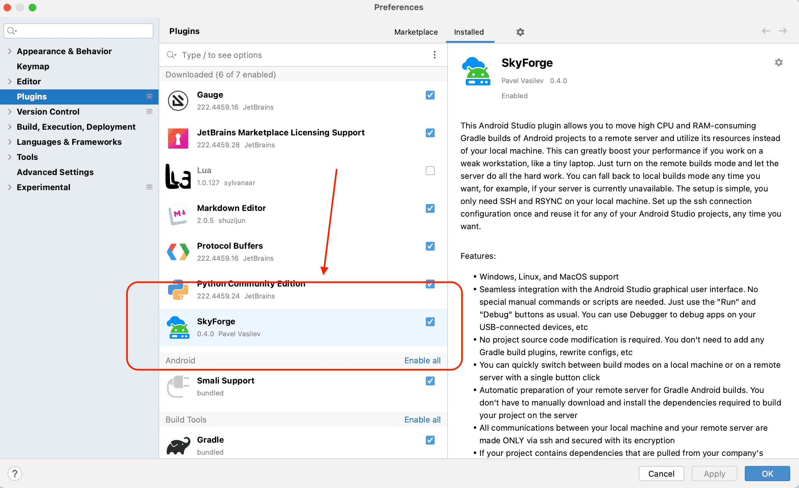
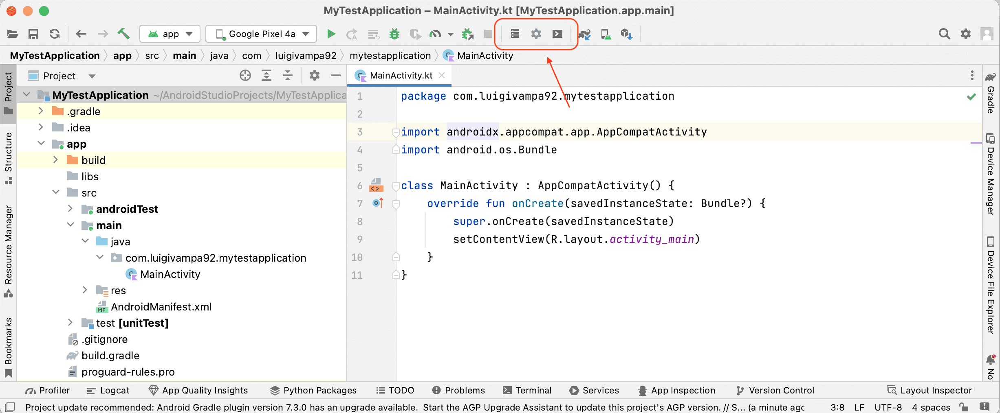
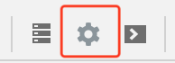
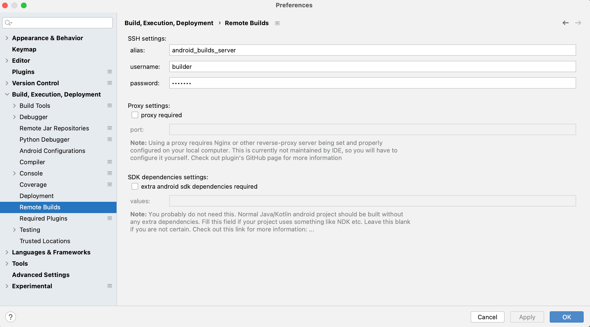
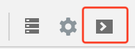
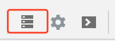
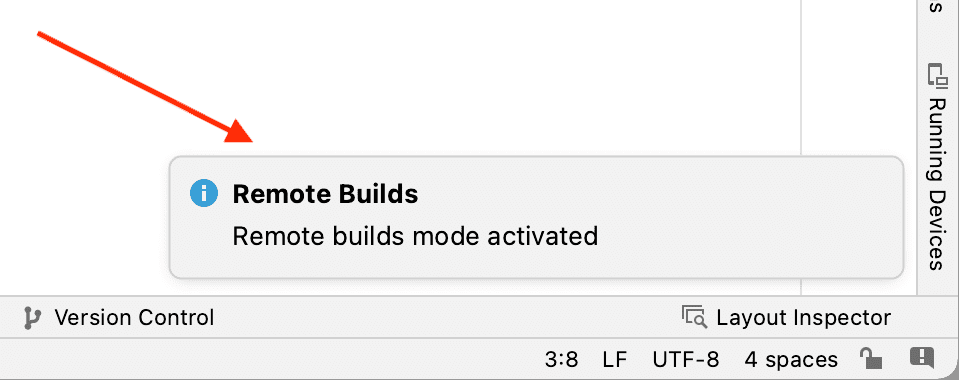

## Usage

Usage of the plugin is very simple.

First, ensure that you finished the previous steps: [setup local computer](./setup_local.md) and [setup remote server](./setup_remote.md).

Then make sure that the Plugin is installed in Android Studio.

After that, new buttons will appear on the Run toolbar:

Those buttons, from the left to the right, are:

- <kbd>Toggle Remote Builds</kbd> - the button that turns on and off the remote builds mode
- <kbd>Remote Builds Settings</kbd> - the button that opens a plugin configuration settings
- <kbd>Prepare Server For Builds</kbd> - the button that triggers the update of all the system, Java, and Android dependencies that are required to build your current project on the server

## Set up plugin configuration

First of all, you have to set up your ssh connection data. To do so, open the Plugin Settings page. This can be done in one of two ways:

- Press the <kbd>Remote Builds Settings</kbd> button on the toolbar, the second one from the new buttons 
  
   

- Open the <kbd>Preferences</kbd> or <kbd>Settings</kbd> menu (depending on your operating system), and click the <kbd>Build, Execution, Deployment</kbd> submenu. There you will find a new settings screen: <kbd>Remote Builds</kbd>

First of all, insert your ssh connection values. You will have to enter your ssh alias (in my example, it was <kbd>android_builds_server</kbd>), user name, and password on the remote machine (in my example, it was <kbd>builder</kbd> and <kbd>builder</kbd> respectively).

If you are using a <kbd>root</kbd> user, then leave the password field blank.

Now click the <kbd>OK</kbd> button. After the configuration is applied, other buttons should become available.

## Prepare dependencies on the remote server

To prepare the dependencies on your remote server, all you have to do is click <kbd>Prepare Server For Builds</kbd>, the third of the new buttons.

Simple as that! This starts a task that will connect to the remote server, check that everything is properly installed, and if not, then install missing dependencies. This includes JDK, Android SDK, Android cmdline-tools, platform-tools, and the dependencies that are specific for your project: compileSdk, build-tools, etc. If you already have everything installed, then the task will just skip the installation and show the success notification.

**NOTE!** This might take some time the first time you run it. Be patient.

**NOTE!** This dependency check should be re-run in some cases, like:

- You have changed compileSdk or build-tools versions in your current project
- You start to work on a new project
- You have some new Android SDK dependencies in general

The thing is, if your server does not have some of the dependencies required for Gradle build, it will still start the build process but crash during the build, so it's better to just let the plugin double-check everything, it's quick and cheap.

Now the server is ready to make Gradle builds, and you can toggle the remote builds mode!

## Enable remote builds mode

Just click the <kbd>Toggle Remote Builds</kbd> button, the left one.

The plugin will check the connection to the remote server, prepare some local environment stuff for your project, and if everything is fine, mark your current project as "The project to build remotely" and show the success notification.

From here, you should just use Android Studio as you usually do. You do not have any specific buttons, tasks, or scripts. You do not have to apply any build plugins to the project or change the source code in any way. Just click those "Run" or "Debug" buttons, or execute Gradle tasks via terminal, everything will now be performed on the remote server, and the result will be transferred to your local computer and used here.

**Enjoy faster builds!**

**NOTE!** The very first build you perform on the remote server might take some time because it will require downloading the Gradle distribution on the server, and Gradle caches are not yet prepared, etc. Subsequent builds will be performed much faster.

## Disable remote builds mode

There are a number of cases when you want to run your builds locally. For instance, you might have a very poor connection to the server or not have it at all (if you are currently in flight). If you need to disable remote builds mode, just press the "Toggle Remote Builds" button once again, and you will return to normal local Gradle execution, all commands will now be performed on your local computer.

## Additional features

The plugin supports a number of additional features and use cases. You can read about them here:

- Using ssh reverse tunnels to access private Maven/Nexus repositories in the companies' VPNs without actually setting a VPN connection on the remote server itself. Read more [here](./usage_proxy.md)
- Building a project that requires additional non-standard dependencies to be built, like NDK, etc. Read more [here](./usage_extra_sdk_dependencies.md) (NOT YET PROPERLY TESTED!)